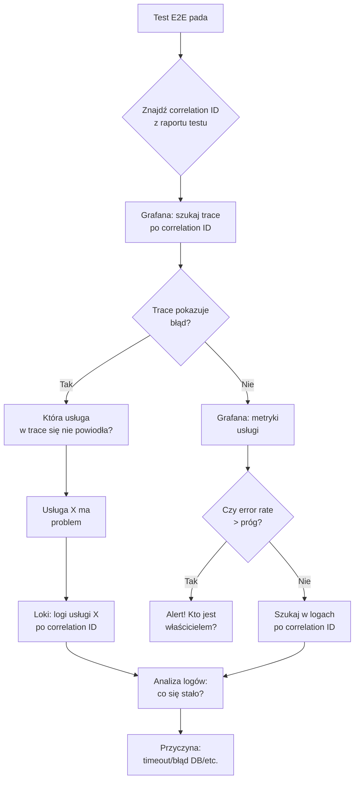

# Grafana, Prometheus, Loki i Kibana — Praktyczna Analiza Diagnostyczna

> **Perspektywa Full Stack Testera**
> Po wdrożeniu nowej wersji testy checkoutu zaczynają padać. Dashboard pokazuje wzrost p95 latencji i błędów 5xx w usłudze payment-api. Ale który konkretnie endpoint? który użytkownik? które żądanie? Umiejętność nawigowania po narzędziach obserwowalności — Grafanie, Prometheusie, Lokach i Kibanie — zamienia Cię z osoby, która wie że coś jest nie tak, w osobę, która wie dokładnie co, gdzie i dlaczego. W tej lekcji zdobędziesz praktyczne umiejętności czytania dashboardów, pisania zapytań PromQL i LogQL, konfigurowania alertów i wykorzystywania narzędzi obserwowalności do diagnozowania awarii testów.

---

## Cel lekcji

Po tej lekcji będziesz potrafić:

- **Czytać** dashboardy Grafana i interpretować wykresy metryk
- **Pisać** podstawowe zapytania PromQL dla metryk usługowych
- **Wyszukiwać** logi po correlation ID, czasie i serwisie
- **Konfigurować** alerty z jasnymi progami i właścicielami
- **Analizować** regresję jakości po wdrożeniu nowej wersji
- **Powiązywać** wynik testu z konkretnymi danymi w narzędziach

---

## Wprowadzenie — dashboard jako odpowiedź na pytanie

Dobry dashboard to nie zbiór losowych wykresów. To odpowiedź na konkretne pytanie: „Czy moja usługa działa poprawnie?". Każdy panel odpowiada na jedno pytanie, a cały dashboard tworzy narrację.

**Zła praktyka:**
- Panel pokazujący „wszystkie metryki CPU"
- Bez kontekstu, bez progu, bez znaczenia

**Dobra praktyka:**
- Panel: „CPU > 80% przez > 5 min?" — odpowiada na pytanie „Czy mamy problem z zasobami?"
- threshold line na 80%
- Kolor: zielony → żółty → czerwony

---

## Sytuacja przewodnia — regresja po wdrożeniu

Po wdrożeniu payment-api v2.3 testy checkoutu zaczynają padać. Dashboard pokazuje wzrost p95 i błędów 5xx. Zadanie: znaleźć dokładną przyczynę, korzystając z Grafany, Prometheusa, Loki i Kibany.

---

## 1. Prometheus i PromQL — podstawy

### 1.1 Architektura Prometheus

```
┌─────────────────┐
│  payment-api    │ ─── metryki expose ───┐
│  (instrumentacja)│                      │
└─────────────────┘                      ▼
                                   ┌──────────────┐
┌─────────────────┐                 │  Prometheus  │ ◄── scrape co 15s
│  checkout-api   │ ─── metryki     │  (TSDB)      │
│                 │                 └──────────────┘
└─────────────────┘                         │
                                           ▼
                                      ┌──────────────┐
┌─────────────────┐                   │   Grafana    │ ◄── dashboardy
│  db-postgres    │ ─── metryki       │   Loki       │ ◄── logi
└─────────────────┘                   │   Tempo      │ ◄── trace
                                       └──────────────┘
```

### 1.2 Typy metryk Prometheus

| Typ | Opis | Przykład |
|-----|------|----------|
| **Counter** | Licznik, tylko w górę | `http_requests_total` |
| **Gauge** | Wartość chwilowa | `cpu_usage_percent` |
| **Histogram** | Rozkład wartości z bucketami | `http_request_duration_seconds` |
| **Summary** | Rozkład z quantile | Podobne do histogram, ale liczone na serwerze |

### 1.3 Podstawowe zapytania PromQL

```promql
# Rate — żądania na sekundę
rate(http_requests_total{service="payment-api"}[5m])

# Rate błędów — błędy na sekundę (status 5xx)
rate(http_requests_total{service="payment-api", status=~"5.."}[5m])

# Procent błędów (error rate)
(
  rate(http_requests_total{service="payment-api", status=~"5.."}[5m])
  /
  rate(http_requests_total{service="payment-api"}[5m])
) * 100

# P95 latencja (histogram_quantile)
histogram_quantile(
  0.95,
  sum(rate(http_request_duration_seconds_bucket{service="payment-api"}[5m])) by (le)
)

# P99 latencja
histogram_quantile(
  0.99,
  sum(rate(http_request_duration_seconds_bucket{service="payment-api"}[5m])) by (le)
)

# Availability (dostępność procentowa)
(
  rate(http_requests_total{service="payment-api", status=~"2.."}[5m])
  /
  rate(http_requests_total{service="payment-api"}[5m])
) * 100

# Saturation — ile kolejek jest zajętych
queue_depth / queue_capacity

# Zmiana w czasie (compared to 24h ago)
rate(http_requests_total{service="payment-api"}[5m])
/
rate(http_requests_total{service="payment-api"}[5m] offset 24h)
```

### 1.4 Agregacje w PromQL

```promql
# Sum — suma wszystkich serwisów
sum(rate(http_requests_total[5m]))

# Sum by service — suma per serwis
sum(rate(http_requests_total[5m])) by (service)

# Sum by service and status — per serwis i status
sum(rate(http_requests_total[5m])) by (service, status)

# Topk — top 5 najwolniejszych endpointów
topk(5,
  histogram_quantile(0.95,
    sum(rate(http_request_duration_seconds_bucket[5m])) by (le, endpoint)
  )
)

# Bottomk — endpointy z największym error rate
bottomk(5,
  (
    rate(http_requests_total{status=~"5.."}[5m])
    /
    rate(http_requests_total[5m])
  ) * 100
) by (endpoint)
```

### 1.5 Praktyczne zapytania dla testera

```promql
# Czy moja usługa jest zdrowa? (4xx errors)
rate(http_requests_total{service="payment-api", status=~"4.."}[5m])

# Czy latency rośnie? (porównanie z wczoraj)
histogram_quantile(0.95, rate(http_request_duration_seconds_bucket{service="payment-api"}[5m]))
/
histogram_quantile(0.95, rate(http_request_duration_seconds_bucket{service="payment-api"}[5m] offset 24h))

# Który endpoint ma najgorszy P95?
topk(3,
  histogram_quantile(0.95,
    sum(rate(http_request_duration_seconds_bucket[5m])) by (le, method, endpoint)
  )
)

# Czy mamy timeouty?
sum(rate(http_requests_total{service="payment-api", error="timeout"}[5m]))

# Ile żądań czeka w kolejce?
queue_messages_pending{service="payment-queue"}

# Jaki jest throughput (żądań na sekundę)?
sum(rate(http_requests_total{service="payment-api"}[1m]))
```

---

## 2. Grafana — wizualizacja i analiza

### 2.1 Typy paneli i ich zastosowanie

| Typ panelu | Zastosowanie | Przykład |
|------------|--------------|----------|
| **Stat** | Pojedyncza wartość | „Aktualny error rate: 2.3%" |
| **Timeseries** | Trend w czasie | „Latency P95 przez ostatnie 24h" |
| **Table** | Dane strukturalne | „Top 10 correlation IDs z błędami" |
| **Gauge** | Wartość z progami | „SLO compliance: 99.5%" |
| **Bar gauge** | Wiele wartości | „Error rate per service" |
| **Heatmap** | Rozkład gęstości | „Latency distribution" |

### 2.2 Dashboard dla diagnozy testów E2E

```json
{
  "title": "E2E Test Failure Analysis",
  "panels": [
    {
      "title": "Error Rate by Service — Last 1h",
      "type": "timeseries",
      "targets": [
        {
          "expr": "sum(rate(http_requests_total{service=~\".+\", status=~\"5..\"}[5m])) by (service)",
          "legendFormat": "{{service}}"
        }
      ],
      "fieldConfig": {
        "defaults": {
          "thresholds": {
            "mode": "absolute",
            "steps": [
              { "value": 0, "color": "green" },
              { "value": 0.01, "color": "yellow" },
              { "value": 0.05, "color": "red" }
            ]
          }
        }
      }
    },
    {
      "title": "P95 Latency by Endpoint — comparison before/after deploy",
      "type": "timeseries",
      "targets": [
        {
          "expr": "histogram_quantile(0.95, sum(rate(http_request_duration_seconds_bucket[5m])) by (le, endpoint))",
          "legendFormat": "{{endpoint}}"
        }
      ],
      "options": {
        "legend": { "displayMode": "table", "values": ["last"] }
      }
    },
    {
      "title": "Test Correlation IDs with Errors — Today",
      "type": "table",
      "targets": [
        {
          "expr": "topk(10, count by (correlation_id) (error_logs_total{correlation_id=~\"e2e-.*\"}))",
          "format": "table",
          "legendFormat": "{{correlation_id}}"
        }
      ],
      "transformations": [
        {
          "type": "organize",
          "options": {
            "excludeByName": { "Time": true },
            "renameByName": {
              "Value": "Error Count",
              "correlation_id": "Correlation ID"
            }
          }
        }
      ]
    }
  ]
}
```

### 2.3 Porównanie przed/po wdrożeniu

```promql
# Latencja po wdrożeniu vs przed wdrożeniem
# Zmiana = nowa wersja / stara wersja
histogram_quantile(0.95,
  sum(rate(http_request_duration_seconds_bucket{service="payment-api", version="v2.3"}[5m])) by (le)
)
/
histogram_quantile(0.95,
  sum(rate(http_request_duration_seconds_bucket{service="payment-api", version="v2.2"}[5m])) by (le)
)

# Error rate porównanie
(
  rate(http_requests_total{service="payment-api", status=~"5..", version="v2.3"}[5m])
  /
  rate(http_requests_total{service="payment-api", version="v2.3"}[5m])
)
-
(
  rate(http_requests_total{service="payment-api", status=~"5..", version="v2.2"}[5m])
  /
  rate(http_requests_total{service="payment-api", version="v2.2"}[5m])
)
```

---

## 3. Loki — logi z Kubernetes/logów

### 3.1 Struktura logów w Loki

Loki nie przechowuje pełnych logów tekstowych — przechowuje **labele** i **streamy**. Log jest identyfikowany przez etykiety, nie przez treść.

```
{service="payment-api", namespace="production", env="prod", level="error"}
```

### 3.2 LogQL — język zapytań Loki

```logql
# Szukaj logów z correlation ID
{service="payment-api"} |= "correlation_id=abc123"

# Szukaj błędów payment
{service="payment-api"} | json | level="error" | payment_error != ""

# Szukaj timeoutów
{service="payment-api"} |= "timeout"

# Szukaj z ostatnich 5 minut
{service="payment-api"} |= "abc123" | __error__=""

# Agregacja — liczba błędów per correlation ID
sum by (correlation_id) (count_over_time(
  {service="payment-api", level="error"} |= "e2e-" [5m]
))

# Logi z określonego czasu
{service="payment-api"} |= "2024-06-23T10:30" | json

# Logi z konkretnym statusem
{service="checkout-api"} | json | status >= 500
```

### 3.3 Przykładowe zapytania dla testera

```logql
# Wszystkie logi z testu (correlation ID z prefiksem e2e-)
{service=~".+"} |= "e2e-"

# Logi błędów z checkout-api
{service="checkout-api", level="error"}

# Szukaj specyficznego błędu
{service="payment-api"} |= "PAYMENT_TIMEOUT" |= "timeout after 5000ms"

# Logi z konkretnego użytkownika testowego
{service=~".+"} |= "test-user-" |= "payment"

# Analiza: ile błędów per usługa w ostatniej godzinie?
sum by (service) (count_over_time(
  {level="error"} | json [1h]
))
```

### 3.4 Integracja Loki z Playwright

```typescript
// tests/helpers/loki-helper.ts
export async function queryLokiLogs(
  logQL: string,
  limit: number = 100
): Promise<any[]> {
  const response = await fetch(`${process.env.LOKI_URL}/loki/api/v1/query_range`, {
    params: {
      query: logQL,
      limit: limit.toString(),
      start: (Date.now() - 3600000).toString(),  // ostatnia godzina
      end: Date.now().toString(),
    },
  });
  
  const data = await response.json();
  
  if (data.status !== 'success') {
    throw new Error(`Loki query failed: ${data.message}`);
  }
  
  return data.data.result.flatMap((stream: any) =>
    stream.values.map((v: any[]) => ({
      timestamp: v[0],
      log: atob(v[1]),
    }))
  );
}

test('find error logs for test correlation ID', async ({}, testInfo) => {
  const correlationId = process.env.TEST_CORRELATION_ID;
  
  if (!correlationId) {
    console.log('⚠️ No correlation ID set — skipping Loki query');
    return;
  }
  
  const logs = await queryLokiLogs(
    `{service=~".+"} |= "${correlationId}"`,
    50
  );
  
  console.log(`Found ${logs.length} log entries for correlation ID ${correlationId}`);
  
  for (const log of logs) {
    console.log(`[${log.timestamp}] ${log.log}`);
  }
  
  // Attach to test report
  const logOutput = logs.map(l => `[${l.timestamp}] ${l.log}`).join('\n');
  await testInfo.attach('loki-logs.txt', {
    body: logOutput,
    contentType: 'text/plain',
  });
});
```

---

## 4. Kibana — alternatywa dla logów

### 4.1 Kiedy Loki vs Kibana?

| Aspekt | Loki | Kibana |
|--------|------|--------|
| **Ekosystem** | Grafana-native | Elastic stack |
| **Wydajność** | Bardzo dobra przy dużej skali | Dobra, ale droższa |
| **Integracja** | Prometheus, Kubernetes | Dowolne źródła |
| **Query language** | LogQL | KQL (Kibana Query Language) |
| **Trace** | Tempo (separate) | Wbudowane (APM) |

### 4.2 KQL — Kibana Query Language

```kql
# Szukaj po correlation ID
correlation_id: "e2e-abc123"

# Szukaj błędów z payment
message: "payment" AND level: "error"

# Zakres czasowy
@timestamp:[now-1h TO now]

# Wildcard
service: "/api/payment*"

# Boolean
(service: "payment-api" OR service: "checkout-api") AND status: 500

# Regex
message: /timeout.*payment.*exceeded/
```

### 4.3 Przykładowe wyszukiwania w Kibana

```kql
# Błędy 5xx w usłudze payment-api
service: "payment-api" AND status: [500 TO 599]

# Logi z correlation ID
correlation_id: "e2e-20240623-abc123"

# Timeouty w określonym czasie
message: "timeout" AND @timestamp: "2024-06-23T10:3*"

# Użytkownik testowy
user_email: "test-*@example.com" AND action: "checkout"
```

---

## 5. Alerty — konfiguracja i zarządzanie

### 5.1 Zasada dobrego alertu

| Element | Wymaganie |
|---------|-----------|
| **Warunek** | Jasny próg (np. error_rate > 1%) |
| **Okno** | Czas trwania (np. przez 5 min) |
| **Właściciel** | Kto odpowiada za alert |
| **Akcja** | Co się dzieje (Slack, email, PagerDuty) |
| **Runbook** | Link do procedury naprawczej |
| **Suppression** | Kiedy NIE alertować (maintenance) |

### 5.2 Alert w Grafana

```yaml
# grafana-alert.yaml
apiVersion: 1
groups:
  - orgId: 1
    name: payment-api-alerts
    folder: Services
    interval: 1m
    rules:
      - uid: payment-api-error-rate-high
        title: Payment API Error Rate High
        condition: C
        data:
          - refId: A
            query:
              params:
                - A
                - 5m
                - now
              datasourceUid: prometheus
              model:
                expr: |
                  (
                    rate(http_requests_total{service="payment-api", status=~"5.."}[5m])
                    /
                    rate(http_requests_total{service="payment-api"}[5m])
                  ) * 100
                refId: A
            relativeTimeRange:
              from: 300
              to: 0
          - refId: B
            model:
              conditions:
                - evaluator:
                    params:
                      - 1
                    type: gt
                  operator:
                    type: and
                  query:
                    params:
                      - A
                  reducer:
                    type: last
              refId: B
              type: threshold
          - refId: C
            model:
              conditions:
                - evaluator:
                    params:
                      - 1
                      - 0
                    type: gt
              refId: C
              type: threshold
        noDataState: NoData
        execErrState: Error
        for: 5m
        annotations:
          summary: "Payment API error rate above 1%"
          description: |
            Error rate is {{ $values.B.Value | printf "%.2f" }}%
            Threshold: 1%
            
            Possible causes:
            - External payment provider outage
            - Database connection issues
            - Recent deployment regression
            
            [View Dashboard](https://grafana.example.com/d/payment-api)
            [View Logs](https://grafana.example.com/explore?left=["{\"expr\":\"{service=\\\"payment-api\\\"}\"}"])
        labels:
          severity: critical
          team: payments
          owner: backend-team
        isPaused: false
```

### 5.3 Alerting w Prometheus (AlertManager)

```yaml
# alertmanager.yaml
global:
  smtp_smarthost: 'smtp.example.com:587'
  smtp_from: 'alerts@example.com'

route:
  receiver: 'default-receiver'
  group_by: ['service', 'alertname']
  group_wait: 30s
  group_interval: 5m
  repeat_interval: 4h
  
  routes:
    - match:
        severity: critical
      receiver: 'pagerduty-critical'
      group_wait: 10s
      
    - match:
        severity: warning
      receiver: 'slack-warnings'
      
inhibit_rules:
  - source_match:
      severity: 'critical'
    target_match:
      severity: 'warning'
    equal: ['service']
```

### 5.4 Integracja alertów z testami

```typescript
// Alert może wyzwolić automatyczny test po restarcie
test('verify service recovered after alert', async ({ request }) => {
  // Sprawdź czy metryki wróciły do normy
  const metricsResponse = await request.get(`${process.env.PROMETHEUS_URL}/api/v1/query`, {
    params: {
      query: 'rate(http_requests_total{service="payment-api", status=~"5.."}[5m]) / rate(http_requests_total{service="payment-api"}[5m]) * 100',
    },
  });
  
  const data = await metricsResponse.json();
  const errorRate = parseFloat(data.data.result[0]?.value[1] || '100');
  
  console.log(`Error rate after recovery: ${errorRate.toFixed(2)}%`);
  
  // Jeśli error rate < 1% — service jest zdrowy
  expect(errorRate).toBeLessThan(1);
  
  // Jeśli zdrowy — uruchom smoke test
  if (errorRate < 1) {
    await runSmokeTests();
  }
});
```

---

## 6. Praktyczny workflow diagnozy testu

### 6.1 Kroki diagnozy od testu do przyczyny



### 6.2 Skrypt automatyzujący workflow

```typescript
// scripts/diagnose-test-failure.ts
import * as https from 'https';

async function diagnose(correlationId: string) {
  console.log(`🔍 Diagnosing correlation ID: ${correlationId}`);
  
  // 1. Szukaj trace w Tempo/Grafana
  console.log('\n📊 Checking traces...');
  const traceResponse = await fetch(
    `${process.env.GRAFANA_URL}/api/datasources/proxy/3/api/traces/${correlationId}`,
    { headers: { Authorization: `Bearer ${process.env.GRAFANA_TOKEN}` } }
  );
  
  if (traceResponse.ok) {
    const trace = await traceResponse.json();
    console.log(`Found trace: ${trace.spans?.length || 0} spans`);
    for (const span of trace.spans || []) {
      if (span.status?.code !== 0) {
        console.log(`  ❌ ${span.name}: ${span.status?.description || 'ERROR'}`);
      }
    }
  }
  
  // 2. Szukaj logów w Loki
  console.log('\n📝 Checking logs...');
  const logResponse = await fetch(
    `${process.env.LOKI_URL}/loki/api/v1/query_range?query={service=~".+"}|="${correlationId}"&limit=50`,
    { headers: { 'X-Scope-OrgID': 'test' } }
  );
  
  if (logResponse.ok) {
    const logs = await logResponse.json();
    const entries = logs.data?.result?.[0]?.values || [];
    console.log(`Found ${entries.length} log entries`);
    for (const entry of entries.slice(0, 5)) {
      console.log(`  ${atob(entry[1])}`);
    }
  }
  
  // 3. Sprawdź metryki
  console.log('\n📈 Checking metrics...');
  const metricsResponse = await fetch(
    `${process.env.PROMETHEUS_URL}/api/v1/query?query=rate(http_requests_total{service=~".+"}[5m])`,
  );
  
  if (metricsResponse.ok) {
    const metrics = await metricsResponse.json();
    console.log(`${metrics.data.result.length} services monitored`);
  }
  
  console.log('\n✅ Diagnosis complete');
}

// Użycie
diagnose(process.argv[2] || 'e2e-test-correlation-id');
```

---

## 7. Lista kontrolna narzędzi obserwowalności

| Narzędzie | Umiejętność | Tak | Nie |
|-----------|------------|-----|-----|
| **Prometheus** | Pisanie PromQL dla rate, histogram_quantile | ☐ | ☐ |
| **Grafana** | Nawigowanie po dashboardzie, odczytywanie wykresów | ☐ | ☐ |
| **Loki** | Szukanie logów po correlation ID, service | ☐ | ☐ |
| **Kibana** | KQL query dla logów Elastic | ☐ | ☐ |
| **Alerting** | Rozumienie progu, właściciela, akcji | ☐ | ☐ |
| **Trace** | Łączenie trace z correlation ID | ☐ | ☐ |

---

## Perspektywa Full Stack Testera

Narzędzia obserwowalności to lupa testera. Bez nich widzisz powierzchnię — UI mówi „błąd". Z nimi widzisz wnętrze — API timeout, DB constraint violation, external provider 500. Umiejętność nawigowania po Grafanie, Lokach i Prometheusie nie jest „tylko dla DevOps" — to kompetencja testera, który chce być efektywny w diagnozowaniu problemów.

Pamiętaj: test wykrywa problem. Ty używasz narzędzi obserwowalności, żeby wiedzieć dokładnie gdzie i dlaczego.

---

## Podsumowanie

- **Prometheus + PromQL** — metryki w czasie: rate, histogram_quantile, aggregacje
- **Grafana** — wizualizacja i dashboardy; każdy panel odpowiada na jedno pytanie
- **Loki + LogQL** — szukanie logów po correlation ID, service, time range
- **Kibana + KQL** — alternatywa dla logów Elastic
- **Alerty** — próg + okno + właściciel + akcja + runbook
- **Workflow diagnozy** — test → correlation ID → trace → logi → metryki → przyczyna

---

## Linki i źródła

- **[Prometheus — Querying](https://prometheus.io/docs/prometheus/latest/querying/basics/)** — kompletna dokumentacja PromQL
- **[Grafana Documentation](https://grafana.com/docs/grafana/latest/)** — wszystko o Grafanie
- **[Loki — LogQL](https://grafana.com/docs/loki/latest/logql/)** — język zapytań Loki
- **[Kibana — KQL](https://www.elastic.co/guide/en/kibana/current-kuery-query-language.html)** — Kibana Query Language
- **[Alerting Best Practices](https://grafana.com/docs/grafana/latest/alerting/best-practices/)** — jak tworzyć sensowne alerty
- **[Prometheus Histograms](https://prometheus.io/docs/practices/histograms/)** — używanie histogramów efektywnie
- **[SLO Monitoring with Prometheus](https://prometheus.io/docs/practices/consoles/)** — przykładowe dashboardy konsoli